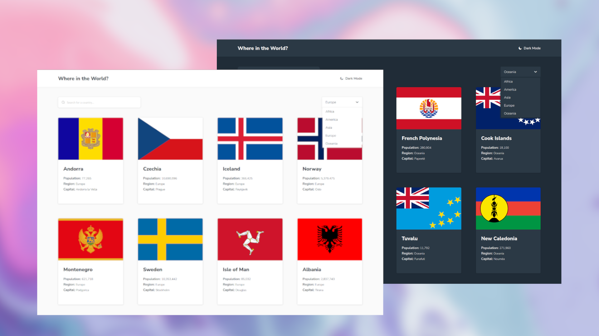

# Frontend Mentor - REST Countries API with color theme switcher solution

## Table of contents

- [Overview](#overview)
  - [The challenge](#the-challenge)
  - [Screenshot](#screenshot)
  - [Links](#links)
- [My process](#my-process)
  - [Built with](#built-with)
  - [What I learned](#what-i-learned)
  - [Continued development](#continued-development)
  - [Useful resources](#useful-resources)
- [Author](#author)
- [Acknowledgments](#acknowledgments)

## Overview

This project marks a key step in my journey as I delve into the integration of the Rest Countries API. The goal here is to pull country data dynamically and showcase it through a user interface built with HTML and CSS.

### The Challenge

The challenge here revolves around providing users with a seamless experience in exploring countries. Key functionalities include enabling users to effortlessly search for countries using an input field, apply filters based on regions, click on any country to view detailed information, and navigate to related border countries. Additionally, the interface should offer a toggle for dark mode, ensuring optimal visibility during nighttime exploration.

### Screenshot

!

### Links

- Solution URL: [Add solution URL here](https://your-solution-url.com)
- Live Site URL: [Add live site URL here](https://your-live-site-url.com)

### Built with

- Semantic HTML5 markup
- CSS custom properties
- Sass
- Flexbox
- CSS Grid
- Mobile-friendly workflow
- Javascript

### What I learned

Throughout this project, I faced and conquered several challenges. Initially, understanding and working with JSON objects were a bit tricky. The introduction of Vite brought some complexity to handling multiple pages, but I managed to figure it out.

Improving mobile responsiveness was easier this time. Using SCSS variables and imports for styling was a new but manageable experience.

Implementing dark mode was a bit challenging, but it provided insights into creating flexible and user-friendly interfaces.

### Continued development

In the future, I aim to strengthen my proficiency in utilizing Vite, exploring more APIs to broaden my understanding. Additionally, I plan to focus on organizing styling layouts in SCSS, enhancing code structure for better maintainability.

### Useful resources

[GET Data from APIwith JavaScript Fetch API](https://www.youtube.com/watch?v=wYWf2m_yzBQ&t=946s)  
[Vite - Modern JavaScript Bundler](https://www.youtube.com/watch?v=9oqu9134U8Q&t=5709s)

## Author

Coming Soon ...

## Acknowledgments

The use of AI has undeniably accelerated my learning process. It proves to be a valuable tool for future developments, aiding in efficient and effective learning experiences.
